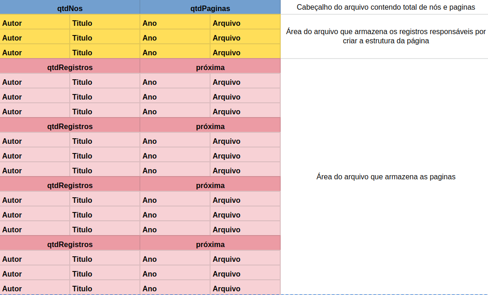
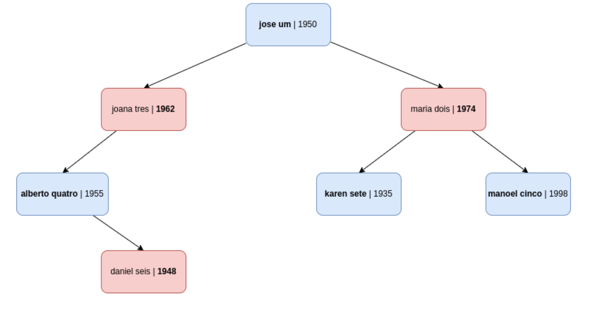
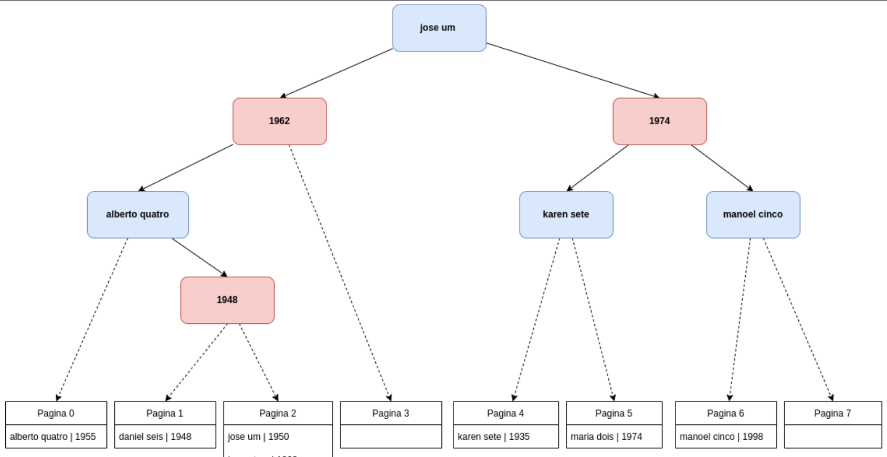
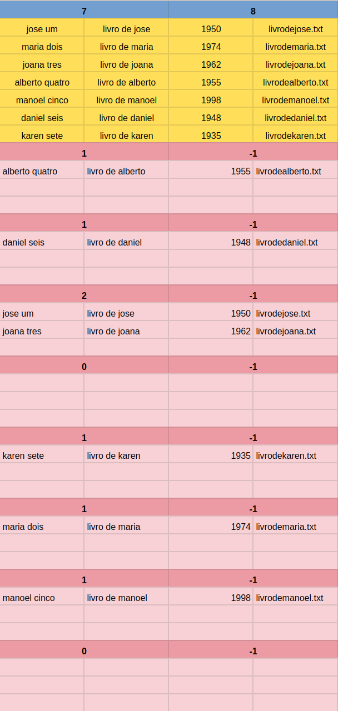

# Árvore k-d

### Estrutura do arquivo

Primeiro é verificado se o arquivo de registros já existe, caso não exista, é feito a leitura da quantidade Q de registros a serem inseridos, então é inserido o valor de Q e a quantidade e páginas no cabeçalho do arquivo e em seguida é feito a leitura da sequência de registros que serão utilizados para criar os índices da árvore k-d  e é feita a inserção no arquivo.  
Em seguida, a árvore  e as páginas são criadas e adiciona-se no arquivo as páginas com a quantidade máxima  de registros em cada uma. Quando o programa for executado novamente a árvore será recriada a partir dos registros dos nós que foram armazenadas no arquivo, num processo similar de quando foram lidos a partir da entrada do usuário.

### Estrutura genérica das estruturas que são armazenadas dentro do arquivo binário

Segue abaixo o resultado do modelo da estrutura do arquivo e da estrutura da árvore após a execução inicial do programa com sete entradas:

| Autor          | Obra             | Ano  | Livro              |
|----------------|------------------|------|--------------------|
| jose um        | livro de jose    | 1950 | livrodejose.txt    |
| maria dois     | livro de maria   | 1974 | livrodemaria.txt   |
| joana tres     | livro de joana   | 1962 | livrodejoana.txt   |
| alberto quatro | livro de alberto | 1955 | livrodealberto.txt |
| manoel cinco   | livro de manoel  | 1998 | livrodemanoel.txt  |
| daniel seis    | livro de daniel  | 1948 | livrodedaniel.txt  |
| karen sete     | livro de karen   | 1935 | livrodekaren.txt   |

### Estrutura da árvore:

### Estrutura da árvore com páginas referenciadas pelo índice:

### Estrutura do arquivo .dat que armazena os dados da  árvore e registros:

No topo do arquivo fica o cabeçalho do arquivo com a quantidade de nós = 7 e de páginas = 8, seguido dos 7 registros responsáveis pela recriação da árvore na memória, que representam os nós. O restante do arquivo é formado por páginas que inicialmente contém 8 páginas, que armazenam os registros que criaram a árvore, mas no decorrer das inserções, serão adicionadas mais páginas para armazenar os novos registros, caso alguma página chegue ao limite estipulado e essa nova página será referenciada pelo índice na página inicial.

### Operação de inserção
Primeiro é verificado o tipo de nó a ser inserido, caso o tipo de nó seja autor, faz a verificação com o auxílio da função strcmp que compara a strings em ordem alfabética, se o nome do autor da obra é menor ou igual ao nome do autor do nó a inserção ocorre à esquerda, e caso seja maior, ocorre a direita.
Caso o tipo de de no seja do tipo ano, faz a comparação entre inteiros, caso o ano da obra seja menor ou igual ao ano do nó a inserção ocorre à esquerda e caso seja maior, ocorre a direita.
A inserção ocorre de forma recursiva, percorrendo a árvore até que seja encontrado o nó esquerdo ou direito que seja NULL.

## Operações de consulta:

### Consulta simples:
É feita a leitura do valor a ser consultado, em seguida verifica-se se existe registro que corresponde a consulta:
comparando o nome do autor do nó raiz com o nome a ser consultado, utilizando a função de comparação de strings que faz a comparação em ordem alfabética e o retorno dessa função retorna um valor inteiro, -1 caso seja menor, 0 caso seja igual e 1 caso seja maior e com isso temos a indicação para qual lado devemos percorrer a árvore, -1 para a esquerda do nó, 0 percorre para os dois lado e 1 percorre para a direita, percorre-se a árvore até que sejam encontrados os nó na com o valor de nome indicado, e imprime os registros da encontrados das páginas, caso não tenha nenhum registro encontrado, imprime mensagem de “nao foi encontrado registro com nome: nome”.

### Consulta por faixa de nomes de autores:
De forma similar a consulta simples, é feito a leitura dos nomes que serão o início e o fim do intervalo de busca, e então, é verificado se o nome do autor da obra é maior ou igual ao nome do autor n1 e menor ao nome do autor n2, considerando-se a ordem alfabética e então imprime os registros das páginas.

### Consulta por faixa de ano:
De forma similar a consulta simples, é feito a leitura dos anos que serão o início e o fim do intervalo de busca, ou seja, é verificado se o ano da obra for maior ou igual ao ano da obra a1 e menor ao ano da obra  a2, então imprime os registros das páginas.

### Consulta por faixa de nomes de autores e ano:
Na consulta por faixa de nome e de autores é verificado se a obra se encontra em ambos os intervalos das consultas descritas acima, tanto de nome dos autores, quanto dos anos das obras, e imprime todas as obras que estão dentro desses intervalos. 

**Observação**: Não foi fornecido na especificação do trabalho a mensagem de “não encontrado” para  as operações de consulta por faixa de valores, dessa forma, ao não ser encontrado uma obra dentro das faixas de valores da consulta, será impresso uma mensagem da seguinte forma:

Para consulta com faixa de valores de anos:
- "nao foi encontrado registro com ano entre: X e Y "

Para consulta com faixa de valores de nomes:
- "nao foi encontrado registro com nome entre: A e B "

Para consulta com faixa de valores de nomes e anos:
- "nao foi encontrado registro com nome entre: A e B e ano entre: X e Y"

### imprime índice da árvore:
Começando na raiz, vamos percorrendo  recursivamente a árvore imprimindo as obras da raiz e dos nós filhos da esquerda e depois da direita em sequência para cada nó e caso o nó corresponda um nó folha, imprime a informação de página.

### imprime página:
Faz a leitura do índice da página ser lido, abre o arquivo e percorre até ser encontrado a página com o índice da entrada, lê o  conteúdo da página no arquivo e imprime todas as obras, se a página estiver cheia e houver referência para outra página, o conteúdo desta página referenciada também será impressa até que acabem as páginas referenciadas. 
